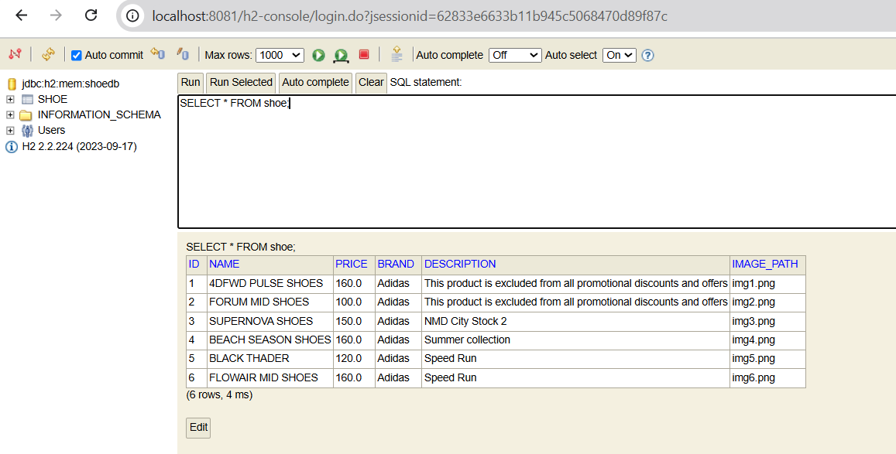
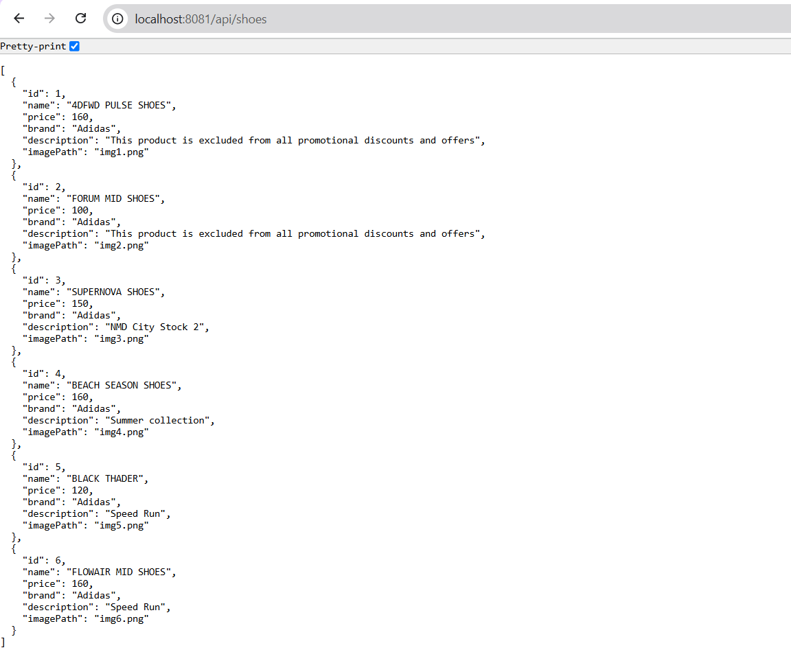

# BTTH_IE303.P22 

Đây là bài tập thực hành số 4 môn IE303 - Công nghệ Java, sử dụng Spring Boot xây dựng một backend đơn giản.

## Yêu cầu bài tập
1. Truy vấn từ cơ sở dữ liệu danh sách các sản phẩm giày hiện có
2. Trả về API danh sách sản phẩm giày

## Công nghệ sử dụng
- Spring Boot 3.2.3
- Spring Data JPA
- H2 Database
- Maven

## Cách chạy ứng dụng
1. Clone repository
2. Chạy lệnh: `mvn spring-boot:run`
3. Truy cập API tại: http://localhost:8081/api/shoes
4. Truy cập H2 Console tại: http://localhost:8081/h2-console
   - JDBC URL: jdbc:h2:mem:shoedb
   - Username: sa
   - Password: (để trống)
## Kết quả truy vấn
1. CSDL

2. API 

